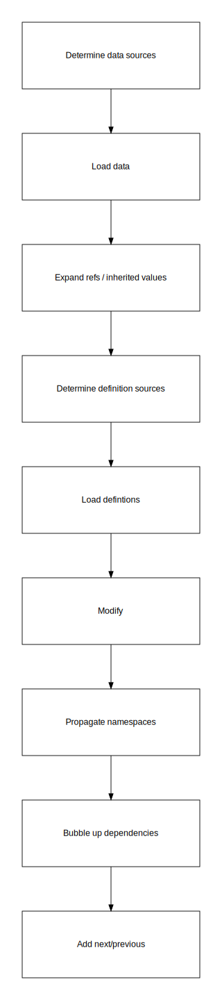
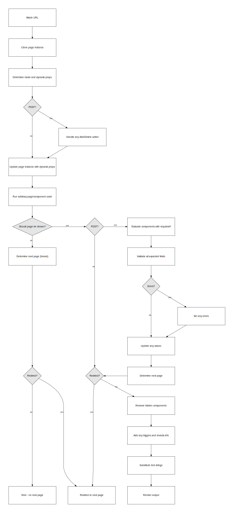

The runner generates the service and captures the input required from users by processing the service’s data using generic code.

## Runtime representation

From the buildtime representation we generate a runtime representation.

- Determine data sources
- Load data
- Expand refs / inherited values
- Determine definition sources
- Load defintions
- Modify data
- Propagate namespaces
- Bubble up dependencies
- Add next/previous pages

## Handling user requests

Using this representation, a runner can map urls to the relevant page.

When a user visits a page, the runner

- Checks that the page should be displayed
- Performs any necessary validation
- Performs any transaction / code
- Update instance representation
- Perform substitution of strings
- Pass instance representation to template renderer